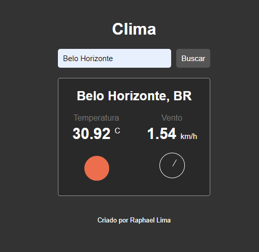

# previsao_do_clima
Esse projeto utiliza JavaScript e mostra a condição climática de todas as cidades do mundo.

## Minha aplicação:

## Sobre a aplicação:

Esse projeto usa JavaScript para extrair dados da API https://openweathermap.org/ 
e por meio desses montar o layout da aplicação e mostrar dados para o usuário a respeito sobre 
a temperatura, condição climática, velocidade e direção do vento, e o país que pertence a cidade pesquisada, tudo em tempo real.

## Por que esse projeto?

Esse projeto foi ensinado em um workshop da empresa b7web, ele foi realizado com o intuito de praticar a manipulação de APIS em um sistema e para 
construção do meu portfólio pessoal.
